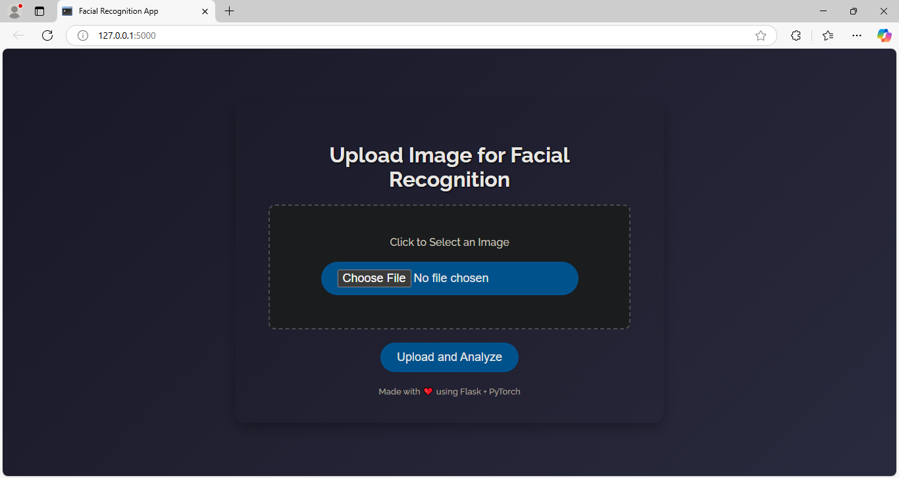
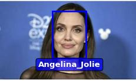
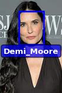
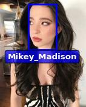
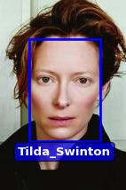
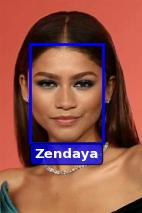
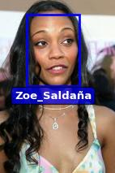

# End-to-End Face Recognition Pipeline

## Overview

This project demonstrates a complete pipeline for face recognition using deep learning, starting from raw video data and culminating in a user-friendly web application. The workflow utilizes state-of-the-art models (MTCNN for detection and InceptionResnetV1 for embeddings), the system is capable of robustly identifying individuals from images. The project is designed to be transparent, reproducible, and modular, making it a strong foundation for further research or real-world applications.

Face recognition is a foundational technology in modern computer vision, with widespread applications in security, digital identity verification, access control, photo organization, and interactive entertainment. This project not only showcases the technical workflow but also highlights best practices in data handling, model evaluation, and ethical considerations.

--- 

## App Demo


---

## Dataset

A real-world, multi-celebrity interview video sourced from YouTube is used to test and demonstrate robust face detection and recognition in unconstrained conditions.
- **Source:** [YouTube - The Hollywood Reporter Actress Roundtable](https://www.youtube.com/watch?v=yG9KMfYfgEo)
- **Celebrities Included:**  
  - Angelina Jolie  
  - Demi Moore  
  - Mikey Madison  
  - Tilda Swinton  
  - Zendaya  
  - Zoe Saldana

This video features six internationally recognized actresses in a professionally recorded setting, ensuring high-quality, diverse, and well-lit facial data. The roundtable format provides varied poses, expressions, and interactions, making it ideal for training and evaluating face recognition systems in realistic, unconstrained conditions.

---

## Project Structure

```
Face_Recognition_App/
├── embeddings/
│   └── embeddings.pt
├── image
│   └── app_interface.png
├── notebooks/
│   └── data-exploration.ipynb
│   └── generate_face_embeddings.ipynb
├── static/
│   └── result0.jpg
│   └── result1.jpg
│   └── result2.jpg
│   └── result3.jpg
│   └── result4.jpg
│   └── result5.jpg
├── templates/
│   └── index.html
├── LICENSE
├── README.md
├── app.py
├── face_recognition.py
└── requirements.txt
```
---

## Notebooks

- **generate_face_embeddings.ipynb** - Step-by-step methodology for frame extraction, face detection, clustering, cropping, and embedding generation.
- **data-exploration.ipynb** - Exploratory data analysis of the video frames and face data.

Refer to these notebooks for in-depth explanations and reproducibility.

---

## Model Architecture

- **Face Detection:** [MTCNN](https://arxiv.org/abs/1604.02878) (Multi-task Cascaded Convolutional Networks)  
  - Detects and aligns faces in each frame.
- **Face Embedding:** [InceptionResnetV1](https://arxiv.org/abs/1602.07261) pretrained on VGGFace2  
  - Converts faces to 512-dimensional embeddings.
- **Clustering:** KMeans  
  - Groups faces by similarity for automatic labeling and verification.

---

## Dependencies

- Python 3.8+
- torch
- torchvision
- facenet-pytorch
- numpy
- opencv-python
- scikit-learn
- Flask
- Pillow
- tqdm
- matplotlib
- seaborn

---
## Usage

### 1. Clone the repository:
```
git clone https://github.com/Aminah-Dodiya/Face_Recognition_App.git
```
### 2. Install the required packages:
```
pip install -r requirements.txt
```

### 3.  Running the Web Application:
```
python app.py
```
- Open your browser at [http://localhost:5000](http://localhost:5000) to use the app. Users can upload an image, and the app will predict the celebrity identity based on the learned embeddings.

---

## Results

The system demonstrates robust face recognition performance on challenging, real-world images. Below are sample results from the web application:

| Test Image                                  | Predicted Identity |
|---------------------------------------------|-------------------|
|  | Angelina Jolie |
|  | Demi Moore |
|  | Mikey Madison |
|  | Tilda Swinton |
|  | Zendaya |
|  | Zoe Saldana |
---

## Future Work

- **Expand Dataset:** Include more individuals and diverse video sources.
- **Real-Time Video Recognition:** Extend the app for live camera input.
- **Model Improvements:** Experiment with newer face embedding architectures (e.g., ArcFace, FaceNet).
- **Bias Mitigation:** Evaluate and improve fairness across demographics.
- **Dockerization:** Package the app for easier deployment.

---

### Contributing
Contributions are welcome!
Feel free to open issues or submit pull requests if you find bugs, or if you have suggestions for new features.

---

## License
This project is licensed under the MIT License — see the LICENSE file for details.

---

## Ethical Considerations

- **Privacy:** Only publicly available, licensed video data is used.
- **Consent:** All individuals are public figures; no private or sensitive data is included.
- **Bias:** The system is trained on a limited set of celebrities and may not generalize to all populations.
- **Intended Use:** This project is for educational and research purposes only. It is not intended for surveillance or commercial deployment.

---
